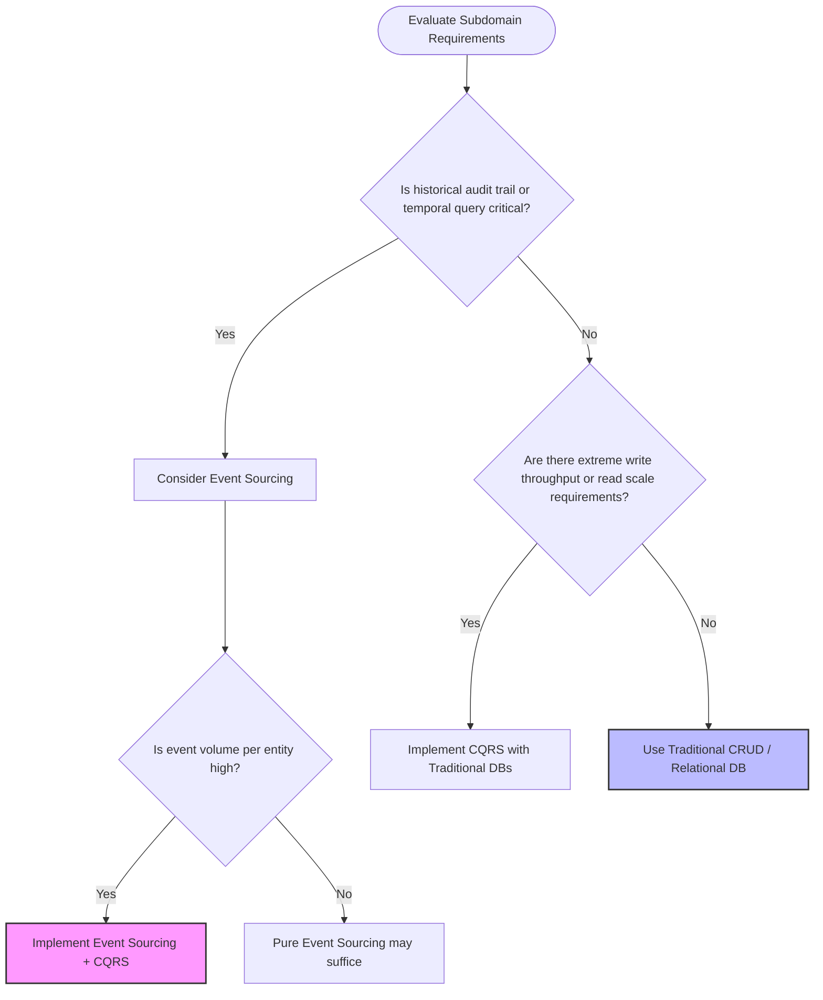

Technical analysis of the decision-making framework for adopting Event Sourcing and CQRS, detailing the specific criteria, indicators, and counter-indicators for their implementation.

---

## 1. Core Decision Drivers for Event Sourcing & CQRS

Adopting Event Sourcing and CQRS represents a significant architectural commitment. Rather than applying these patterns globally, senior architects evaluate specific subdomains against three primary drivers: compliance/auditing, data scale/complexity, and extreme performance requirements.

### A. Regulatory Compliance & Historical Auditing
Certain industries mandate an absolute, immutable record of how data reached its current state.
* **Finance & Ledgers:** Reconstructing balances, auditing transactions, and preventing fraud require a complete history of every financial movement.
* **Healthcare Records:** Patient charts, prescription histories, and clinical interventions require strict traceability for legal and safety compliance.
* **Regulatory Mandates:** Compliance frameworks (e.g., SOX, HIPAA, GDPR audit requirements) are naturally satisfied when the event log *is* the primary database, eliminating the risk of undetected data tampering.

### B. High-Performance Read/Write Asymmetry
When a system experiences extreme load or highly asymmetric read/write ratios, separating the pathways becomes a technical necessity.
* **Write-Heavy Bottlenecks:** Event Sourcing optimizes the write path to simple, sequential disk appends, bypassing the overhead of relational constraints, index updates, and database locks.
* **Read-Heavy Scale:** CQRS allows the read model to be completely denormalized and scaled horizontally across read-replicas or specialized search indexes (e.g., Elasticsearch), delivering sub-millisecond query performance.

### C. Large-Scale Event Streams (Where Pure Event Sourcing Fails)
In systems with high-frequency state changes, replaying thousands of events on-the-fly to reconstruct an entity's state becomes computationally unfeasible. In these scenarios, **CQRS is mandatory** to maintain pre-computed read projections, preventing the system from collapsing under the weight of its own event history.

---

## 2. Architectural Decision Framework

To determine whether to implement Event Sourcing and CQRS, architects can evaluate their system requirements using the following structured decision matrix:

---

## 3. Comparative Suitability Matrix

| **System Attribute** | **Traditional CRUD / RDBMS** | **Event Sourcing + CQRS** |
|---|---|---|
| **System Complexity** | **Low:** Single data model, standard ORMs, straightforward development. | **High:** Dual data models, projection engines, eventual consistency handling. |
| **Audit Requirement** | **Manual:** Requires triggers, temporal tables, or application-level logging. | **Native:** Built directly into the storage engine; 100% reliable. |
| **Write Performance** | **Moderate:** Limited by database locks, indexes, and transaction boundaries. | **Maximum:** Append-only, non-blocking disk writes. |
| **Read Performance** | **Variable:** Dependent on query complexity, joins, and indexing strategies. | **Maximum:** Read models are pre-computed and highly denormalized. |
| **Consistency Model** | **Immediate:** Strong ACID transaction guarantees. | **Eventual:** Base model; read models catch up asynchronously. |

---

## Architectural Synthesis

Event Sourcing and CQRS are highly specialized architectural patterns, not general-purpose solutions. 

For standard line-of-business applications, administrative portals, or simple CRUD (Create, Read, Update, Delete) systems, a traditional relational or document database is the superior choice due to its simplicity, immediate consistency, and low maintenance overhead. 

As a senior architect, the recommendation is to **apply these patterns surgically**. Isolate them to specific bounded contexts—such as a billing engine, a high-frequency trading ledger, or a complex logistics tracking system—where the business value of an immutable history and extreme performance justifies the operational complexity of managing a distributed, eventually consistent data architecture.