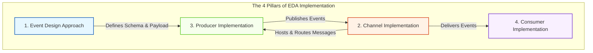

Here is a structured overview of the practical implementation phase of Event-Driven Architecture, followed by a detailed technical breakdown of the four core implementation pillars.

---

## Transitioning from Theory to Implementation

Up to this point, we have explored the conceptual foundations, operational challenges, and advanced patterns of Event-Driven Architecture (EDA). However, moving from architectural design to working software requires translating these concepts into concrete technical decisions. 

Implementing a production-ready EDA system is not a single task; it requires designing and configuring four distinct, highly integrated pillars. Each pillar represents a critical layer of the architecture, and the choices made within each will directly impact the system's scalability, reliability, and maintenance overhead.

---

## The Four Pillars of EDA Implementation

To build a fully functional event-driven system, architects and developers must design and implement the following four core components:

---

## Detailed Breakdown of the Four Pillars

### 1. The Event Design Approach
Before writing code or configuring brokers, you must define how events will represent data. This is the structural foundation of your system.
* **Key Decisions:** Will you use **Event-Carried State Transfer** (where the event contains the full payload of data needed by downstream consumers) or **Event Notification** (where the event is a lightweight ping containing only IDs, forcing consumers to call back for details)?
* **Schema Definition:** Standardizing the serialization format (e.g., JSON, Apache Avro, or Protocol Buffers) and establishing schema registry rules to manage backward and forward compatibility.

### 2. Channel Implementation
The channel (or message broker) is the central nervous system of your EDA. It is responsible for receiving, storing, and routing events safely.
* **Key Decisions:** Choosing the right broker technology based on your system requirements. Do you need a queue-based broker (like RabbitMQ) for complex routing and immediate deletion, or a log-based streaming platform (like Apache Kafka or AWS Kinesis) for high throughput and event retention?
* **Infrastructure Setup:** Configuring exchange types, topics, partitions, consumer groups, and persistence guarantees.

### 3. Producer Implementation
The producer is the component that detects state changes and publishes corresponding events to the channel.
* **Key Decisions:** How will the producer handle failures when publishing? Implementing patterns like the **Transactional Outbox Pattern** ensures that database updates and event publishing happen atomically.
* **Technical Concerns:** Managing connection pools to the broker, handling backpressure, injecting Correlation IDs, and serializing payloads efficiently.

### 4. Consumer Implementation
The consumer is the component that listens to the channel, processes incoming events, and executes the corresponding business logic.
* **Key Decisions:** Ensuring **idempotency** (so that processing the same event multiple times does not result in inconsistent state) and designing error-handling strategies (such as retry policies and Dead Letter Queues).
* **Technical Concerns:** Managing concurrent processing threads, acknowledging messages back to the broker, and extracting metadata like Correlation IDs for logging.

---

## Implementation Decision Matrix

| **Pillar** | **Primary Technical Focus** | **Common Tools & Standards** | **Critical Architectural Risk** |
|---|---|---|---|
| **1. Event Approach** | Payload structure and schema evolutionary rules. | CloudEvents, JSON Schema, Avro | Schema breakage causing downstream consumer failures. |
| **2. Channel** | Message routing, retention, and throughput scaling. | RabbitMQ, Apache Kafka, AWS EventBridge | Broker downtime or partition imbalances causing system-wide blocks. |
| **3. Producer** | Atomic state changes and reliable event dispatching. | Outbox Pattern, Publisher Confirms | "Dual-write" failures where database updates succeed but events are lost. |
| **4. Consumer** | Safe, parallel, and idempotent message processing. | Idempotent Receivers, DLQs, Retry Policies | Poison pill messages causing consumer crash loops. |