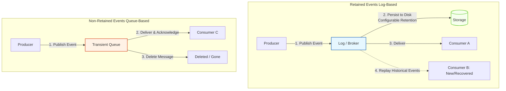

Here is a structured overview of the Event Retention decision, followed by a detailed technical analysis of the two fundamental approaches to event storage in Event-Driven Architecture.

---

## The Storage Dimension of Event Design

When designing an event-driven system, the very first architectural crossroads you will encounter is deciding **how the channel manages the lifecycle of an event after it has been published**. 

This decision splits EDA into two distinct paradigms: **Retained Events** and **Non-Retained Events**. Choosing between these approaches affects more than just storage requirements; it fundamentally dictates how your system handles data recovery, system integration, scalability, and whether your event stream can serve as a reliable system of record.

---

## Visualizing Retained vs. Non-Retained Channels

The structural difference between these two approaches lies in whether the event channel acts as a **durable ledger** or a **transient post office**.

---

## Detailed Analysis of the Two Approaches

### 1. Retaining Events (The Log-Based Approach)
In this model, the channel acts as an append-only, durable log on disk. When a producer publishes an event, it is assigned a sequential offset and written to storage.
* **Retention Period:** The broker retains the event for a configurable duration (e.g., 7 days, 1 year, or indefinitely) regardless of whether consumers have read it.
* **The Power of Replay:** Because events are preserved, a new consumer can be introduced to the system and "replay" the entire history of events from day one to build its state. If a consumer crashes or experiences a bug, it can reset its offset and reprocess past events to correct its data.
* **Key Use Cases:** Event streaming pipelines, auditing, analytics, and systems where the event stream serves as the **Source of Truth** (e.g., Event Sourcing).
* **Primary Technologies:** Apache Kafka, AWS Kinesis, Azure Event Hubs.

### 2. Non-Retaining Events (The Queue-Based Approach)
In this model, the channel acts as a transient buffer. The primary goal is to route and deliver the message to its destination as quickly as possible.
* **Transient Lifecycle:** Once a consumer successfully processes and acknowledges (ACKs) a message, the broker immediately deletes it from memory/disk.
* **No Replay Capability:** If a consumer misses an event (e.g., due to a misconfiguration or offline status during a non-durable queue setup) or needs to reprocess data due to a bug, the event cannot be retrieved from the broker. It is gone forever.
* **Key Use Cases:** In-system asynchronous task execution, point-to-point command routing, and decoupled microservice coordination where state is immediately saved to a traditional database.
* **Primary Technologies:** RabbitMQ, ActiveMQ, AWS SQS.

---

## Architectural Comparison Matrix

| **Feature** | **Retained Events** | **Non-Retained Events** |
|---|---|---|
| **Broker Storage Behavior** | Append-only log; events are persisted to disk for a configured time. | Transient queue; events are deleted immediately after consumer acknowledgment. |
| **Consumer Replay** | **Supported:** Consumers can rewind offsets and reprocess historical data. | **Not Supported:** Once acknowledged, the event is permanently erased. |
| **Primary Focus** | High-throughput streaming, historical analysis, and data integration. | Fast, point-to-point message routing and task distribution. |
| **Scaling Model** | Partition-based scaling (parallel consumers per topic partition). | Competing consumers model (multiple workers pulling from a single queue). |
| **System of Record** | Yes, can act as the single **Source of Truth**. | No, requires an external database to persist system state. |