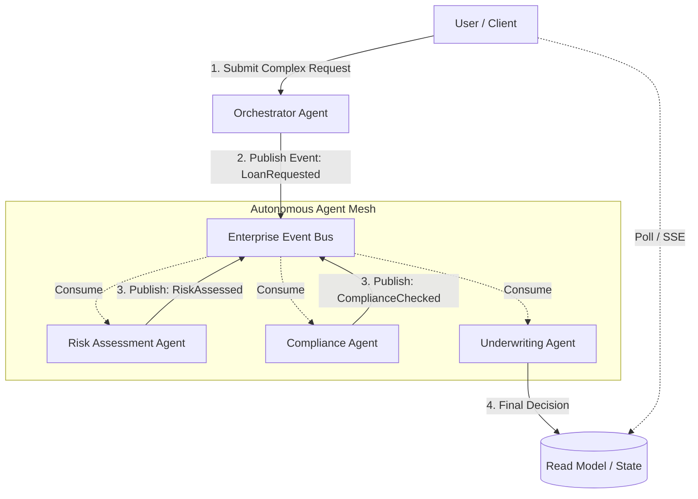

Evaluation of Event-Driven Architecture (EDA) applied to Agentic AI systems, detailing when to leverage asynchronous event fabrics and when to stick to synchronous execution paths.

---

## Context & Overview

The rise of **Agentic AI**—moving from simple single-turn Chatbots to complex **Multi-Agent Meshes**—has introduced a paradigm shift in enterprise software engineering. In a private financial institution serving thousands of concurrent users, an "Agentic Mesh" consists of specialized, autonomous agents (e.g., a Portfolio Analyzer Agent, a Compliance Audit Agent, and a Fraud Detection Agent) collaborating to solve complex user requests.

As an AI Architect, deciding whether to orchestrate these agents using **Synchronous Request-Response (REST/gRPC)** or an **Asynchronous Event-Driven Architecture (EDA)** is critical. While EDA offers decoupling and resilience, applying it incorrectly to user-facing conversational loops can destroy the user experience due to latency and state synchronization overhead. 

Below is a structured framework to guide this high-stakes architectural decision.

---

## Analysis: When to Use EDA in Agentic GenAI

In an agentic mesh, EDA is highly valuable when agent collaboration is **long-running, multi-step, and non-blocking**. 

### 1. Long-Running, Multi-Agent Choreography
When a user request requires multiple agents to work sequentially or in parallel over minutes or hours (e.g., *"Generate a comprehensive 10-year financial plan based on my tax history and risk profile"*), EDA is the industry standard.
* **Choreography over Orchestration:** Agents subscribe to specific event topics (e.g., `TaxDataRetrieved`), perform their LLM-based reasoning, and emit new events (e.g., `RiskProfileAnalyzed`). No single service needs to hold an open connection or block resources.
* **Industry Reference:** This aligns with **LangGraph** (by LangChain) and **Microsoft AutoGen** patterns, where agent state transitions can be modeled as state-graph edges triggered by asynchronous event emissions.

### 2. Human-in-the-Loop (HITL) and Asynchronous Tool Execution
GenAI agents in banking often require human authorization for high-risk actions (e.g., transferring funds or overriding a credit decision).
* **State Preservation:** An agent executes up to a certain point, emits an `ApprovalRequired` event, and safely suspends its state. 
* **Resilience:** The system does not hold open HTTP connections. Once a human approves the action via an admin portal, an `ApprovalGranted` event is published, and the agent resumes execution.

### 3. High-Throughput Tool Ingestion and RAG Updates
If your agents rely on a dynamically updating Vector Database (Retrieval-Augmented Generation), EDA is essential for keeping the knowledge base fresh.
* **Real-time Embeddings:** Document uploads, market feed updates, or transaction logs emit events that trigger asynchronous embedding pipelines, updating the Vector DB without impacting the live chat services.

---

## Analysis: When NOT to Use EDA in Agentic GenAI

Applying the classic architectural rule—**the closer the system is to direct end-user interaction, the less EDA should be used**—we find clear boundaries where EDA fails in GenAI.

### 1. Real-Time Token Streaming (The Chat Loop)
When a customer is interacting with a financial assistant, they expect immediate, token-by-token streaming response (low Time-to-First-Token, or TTFT).
* **The Latency Trap:** Forcing the immediate conversational loop through an asynchronous message broker (like Kafka or RabbitMQ) introduces serialization overhead, network hops, and eventual consistency issues. 
* **The Correct Pattern:** Use direct, stateful, synchronous connections like **WebSockets** or **Server-Sent Events (SSE)** directly from the gateway to a single orchestrator agent.

### 2. Simple Information Assistants (Single-Agent Q&A)
If the agent's primary role is to answer basic queries (e.g., *"What is my current account balance?"* or *"Summarize this PDF"*), introducing EDA is an anti-pattern.
* **Over-Engineering:** A simple RAG pipeline served over a synchronous REST API is vastly superior. Introducing event channels, event stores, and projection engines for simple Q&A adds massive operational complexity with zero performance or scalability benefits.

---

## Agentic GenAI Architecture Decision Matrix

| **Use Case / Pattern** | **Orchestration Style** | **Recommended Tech Stack** | **Why This Pattern?** |
|---|---|---|---|
| **Real-time Chat & Token Streaming** | **Synchronous** (Request-Response) | WebSockets, FastAPI, OpenAI Assistants API | Requires immediate feedback loop ($<200\text{ms}$ TTFT). Avoids broker latency. |
| **Multi-Agent Financial Underwriting** | **Asynchronous** (EDA) | Apache Kafka, LangGraph, AWS Bedrock Agents | Multi-step, long-running, requires auditability of agent decisions. |
| **Human-in-the-Loop (HITL) Approvals** | **Asynchronous** (EDA) | RabbitMQ, Temporal.io, Semantic Kernel | Agents must pause execution safely without blocking compute resources. |
| **Vector DB / Knowledge Base Sync** | **Asynchronous** (EDA) | Kafka, Pinecone/Milvus, AWS Lambda | Decouples document ingestion from the user-facing query path. |

---

## Recommendations & Takeaways

As a Senior AI Architect, your strategy for a private enterprise GenAI deployment should be **hybrid**:

1. **Keep the Edge Synchronous:** The client-to-orchestrator connection must be synchronous (WebSockets/SSE) to ensure a fluid, low-latency conversational experience.
2. **Make the Core Asynchronous:** The background collaboration between specialized agents, compliance checkers, and external financial APIs should be decoupled using an enterprise event bus (EDA).
3. **Auditability is Non-Negotiable:** In financial services, use **Event Sourcing** on the write-side of your agentic mesh. Every tool execution, prompt template version, and LLM response should be stored as an immutable sequence of events. This guarantees 100% compliance and auditability for regulators.