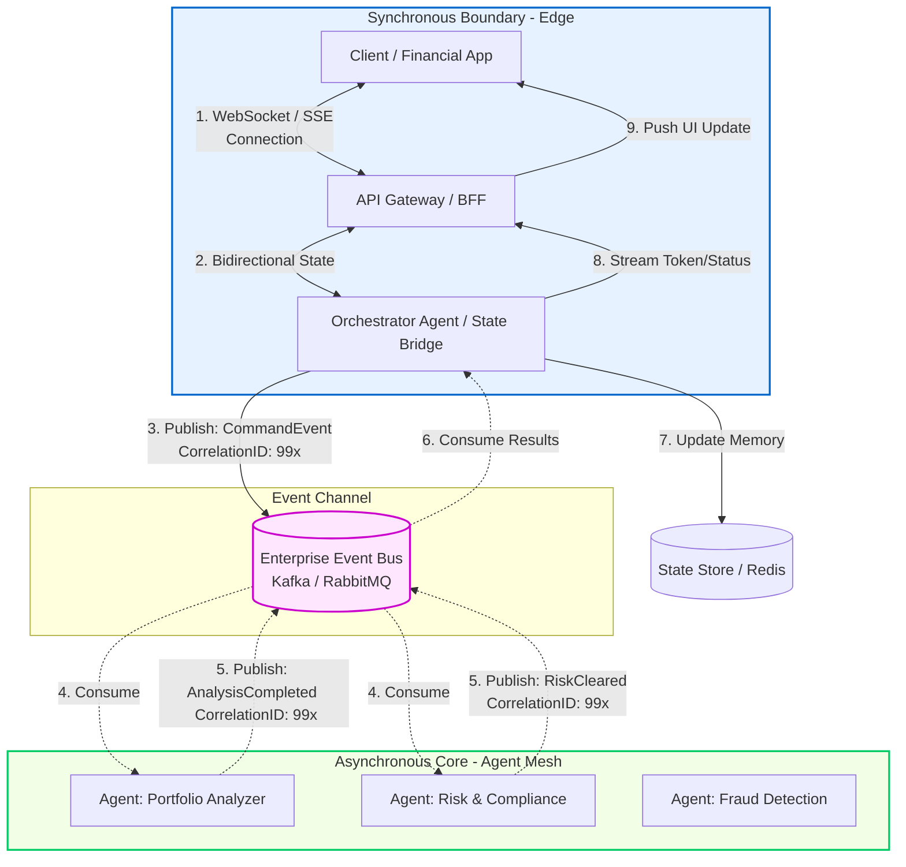

Technical analysis exploring the coexistence of a **Synchronous Edge** and an **Asynchronous Core** within Agentic AI systems

---

## Paradigm Coexistence: The Synchronous-Asynchronous Bridge

In an enterprise financial agentic system, the end-user cannot wait minutes without receiving a response (synchronous blocking), yet internal agents cannot coordinate synchronously without collapsing the infrastructure due to LLM inference latency. 

The solution is a **hybrid design**: the client communicates synchronously/reactively with the system boundary (**the Edge**), while the agent choreography executes in a purely asynchronous manner (**the Core**).



---

## The Technical Conflict: What Happens When Combining Both Approaches?

Yes, a natural **impedance mismatch** exists. The client (browser/mobile app) operates under an *attention-blocking model* (waiting for a response to render the UI), whereas the *Agent Mesh* operates under the principles of *non-blocking execution and eventual consistency*.

If not managed correctly, this clash of paradigms generates two critical issues:

### 1. Connection Starvation
If the API Gateway keeps a traditional HTTP connection (REST) open waiting for the *Agent Mesh* to complete processing (which can take anywhere from 5 to 30 seconds due to LLM reasoning and tool execution), server sockets will quickly deplete under a load of thousands of concurrent users.
* **Mitigation:** The *Orchestrator Agent* must act as a **State Bridge**. The initial connection is immediately upgraded to a lightweight, persistent protocol such as **WebSockets** or **Server-Sent Events (SSE)**.

### 2. Loss of Context and Out-of-Order Events
GenAI agents can take varying amounts of time to respond. Agent A (portfolio analysis) might take 8 seconds, while Agent B (risk assessment) might take 2 seconds. If the system sends responses back to the client out of order, the user interface will display incoherent or outdated information.
* **Mitigation:** Implement the **Correlation ID** pattern and a **Session State Store** (e.g., Redis). Every event emitted by any agent must carry the user's session ID. The *Orchestrator Agent* at the Edge consolidates and orders these events before streaming them to the client.

---

## Integration Patterns to Resolve the Conflict

To make this hybrid architecture work at enterprise scale, architects implement key patterns from classic Enterprise Integration Patterns (EIP):

### A. Asynchronous Request-Reply with UI Projections
Instead of waiting for the entire process to finish, the system immediately responds to the client with a `Processing` state and a task ID.
1. The client subscribes to a notification channel (SSE/WebSockets).
2. Asynchronous agents update a fast-read database (e.g., Redis/DynamoDB) as they complete their respective tasks.
3. The client receives real-time partial updates (e.g., *"Risk Agent has approved the transaction, waiting for portfolio analysis..."*). This dramatically improves the user's **perceived latency**.

### B. The Saga Pattern (Agentic Orchestration)
When agents must perform actual financial transactions (e.g., rebalancing a portfolio), traditional ACID transactions cannot be used across distributed systems. Instead, the **Saga Pattern** is applied. A workflow engine (such as *Temporal.io* or *AWS Step Functions*) coordinates the asynchronous agent calls and, in case of a failure, triggers compensating events to roll back the business state.

---

## High-Industry References

This hybrid approach is backed by the engineering practices of leading organizations in distributed systems and GenAI:

* **ThoughtWorks Technology Radar:** Consistently recommends using the *BFF (Backend-for-Frontend)* pattern as the synchronous/asynchronous bridge for mobile and web applications consuming reactive microservices.
* **AWS Architecture Center (Generative AI Patterns):** Proposes event-driven architectures using *Amazon EventBridge* and *AWS Step Functions* for orchestrating long-running agents, exposing results to the end-user via *AWS AppSync (GraphQL Subscriptions)* or WebSockets.
* **Enterprise Integration Patterns (Gregor Hohpe):** Formally defines the *Half-Sync/Half-Async* pattern, which serves as the theoretical foundation for this design: a synchronous layer for high-speed services and an asynchronous layer for complex, decoupled processing.

```mermaid
graph TD
    %% Client & Edge (Synchronous / Reactive)
    subgraph Edge_Zone [Frontera Síncrona - Edge]
        Client[Cliente / App Financiera]
        Gateway[API Gateway / BFF]
        Orchestrator[Orchestrator Agent / State Bridge]
    end

    %% Event Broker (The Bridge)
    subgraph Message_Fabric [Canal de Eventos]
        EventBus[(Enterprise Event Bus <br/> Kafka / RabbitMQ)]
    end

    %% Core (Asynchronous Agent Mesh)
    subgraph Core_Zone [Core Asíncrono - Agent Mesh]
        AgentA[Agent: Portfolio Analyzer]
        AgentB[Agent: Risk & Compliance]
        AgentC[Agent: Fraud Detection]
    end

    %% Database / State
    StateDB[(State Store / Redis)]

    %% Flow Connections
    Client <-->|1. WebSocket / SSE <br/> Connection| Gateway
    Gateway <-->|2. Bidirectional State| Orchestrator
    
    %% Bridge to Async
    Orchestrator -->|3. Publish: CommandEvent <br/> CorrelationID: 99x| EventBus
    
    %% Async Processing
    EventBus -.->|4. Consume| AgentA
    EventBus -.->|4. Consume| AgentB
    
    AgentA -.->|5. Publish: AnalysisCompleted <br/> CorrelationID: 99x| EventBus
    AgentB -.->|5. Publish: RiskCleared <br/> CorrelationID: 99x| EventBus

    %% Return Path
    EventBus -.->|6. Consume Results| Orchestrator
    Orchestrator -->|7. Update Memory| StateDB
    Orchestrator -->|8. Stream Token/Status| Gateway
    Gateway -->|9. Push UI Update| Client

    %% Styling
    style Edge_Zone fill:#e6f2ff,stroke:#0066cc,stroke-width:2px
    style Core_Zone fill:#f2ffe6,stroke:#00cc66,stroke-width:2px
    style EventBus fill:#ffe6ff,stroke:#cc00cc,stroke-width:2px
