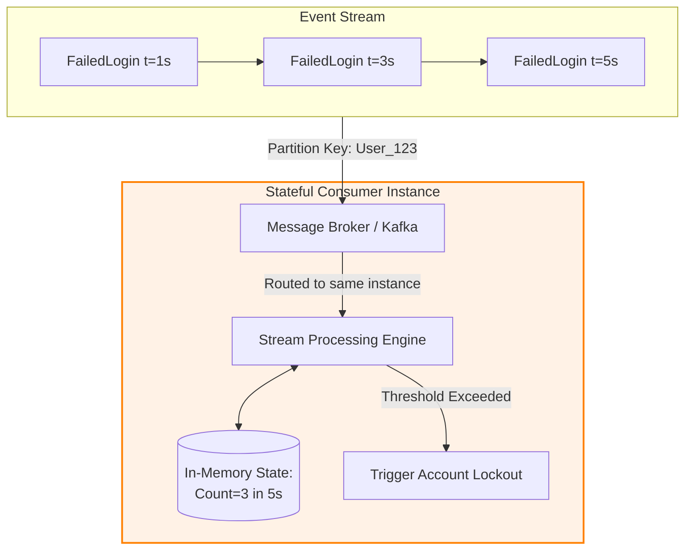

Here is a structured, architect-level analysis of **Stateless vs. Stateful Event-Driven Architecture (EDA)**, designed to provide clear decision criteria for modern distributed systems and agentic AI meshes.

---

## Context & Overview
In Event-Driven Architecture, the distinction between **Stateless** and **Stateful** patterns represents a fundamental choice in how consumers process incoming streams of facts. 

Unlike general software architecture—where "stateful" is often avoided due to scaling bottlenecks—stateful patterns in EDA are highly legitimate and necessary. They do not describe where data is permanently stored, but rather **how a consumer interprets an event in relation to other events over time**.

Below is a structured breakdown of these two patterns, their mechanics, and their architectural trade-offs.

---

## Stateless EDA: Autonomous Event Processing
An architecture is **stateless** when each event handled by a consumer is completely autonomous. The processing of Event $N$ is entirely independent of Event $N-1$ or Event $N+1$.

### Key Characteristics
* **Autonomous Units:** The event contains all necessary context (or pointers to it) to complete its execution path without needing historical context.
* **Consumer Indifference:** It does not matter which instance of a consumer service processes the event. If you have 10 instances of a `PaymentService` scaled horizontally, any instance can process any `OrderSubmitted` event with the exact same outcome.
* **High Horizontal Scalability:** Since there is no shared temporal context between events, scaling out is as simple as adding more consumers to the queue.

> **Architectural Clarification:** Statelessness has nothing to do with whether the event is a *complete payload* or a *pointer payload* (which requires a database lookup). A consumer can query a database to fetch user details and still be architecturally stateless, because the *event itself* does not depend on previous events in the stream.

---

## Stateful EDA: Temporal and Aggregated Processing
An architecture is **stateful** when an incoming event cannot be processed in isolation. Its meaning, validity, or outcome depends on **past or future events** within a specific window of time.

### Key Characteristics
* **Event Chains & Aggregations:** Used when you need to compute metrics over time (e.g., *"Calculate average transaction volume per hour"*) or detect patterns (e.g., *"Flag potential fraud if more than 5 failed login attempts occur within 60 seconds"*).
* **Consumer Affinity (Routing Constraints):** It matters immensely *which* consumer instance receives the event. If Event 1 goes to Consumer A, and Event 2 goes to Consumer B, neither consumer can accurately calculate the aggregate state because their local memories are isolated.
* **Stream Processing Engines:** Typically implemented using specialized stream processing frameworks (e.g., Apache Flink, Kafka Streams, or Spark Streaming) rather than standard message queues.

---

## Comparative Analysis: Stateless vs. Stateful EDA

| **Dimension** | **Stateless EDA** | **Stateful EDA** |
|---|---|---|
| **Event Relationship** | Completely independent and autonomous. | Part of a chain, window, or temporal sequence. |
| **Consumer Routing** | **Any-cast:** Any consumer instance can process the event. | **Keyed-cast:** Events must be routed to specific instances based on a partition key (e.g., `UserID`). |
| **Common Use Cases** | Payment processing, sending emails, generating single invoices. | Fraud detection, telemetry aggregation, rate limiting, session tracking. |
| **Scaling Complexity** | **Low:** Scale horizontally by adding workers to a shared queue. | **High:** Requires consistent hashing, partition rebalancing, and state migration. |
| **Primary Tooling** | RabbitMQ, AWS SQS, standard pub/sub brokers. | Apache Kafka, Apache Flink, Redis Enterprise. |

---

## Architectural Recommendations for GenAI & Enterprise Systems

As you design complex systems, apply these heuristics to choose between stateless and stateful EDA:

1. **Default to Stateless:** Keep consumers stateless wherever possible. It simplifies deployment, scaling, and disaster recovery. If an operation can be modeled as a single, self-contained transaction, do not make it stateful.
2. **Use Stateful for Complex Event Processing (CEP):** When building security, monitoring, or real-time analytics boundaries, embrace stateful EDA. Ensure your message broker supports **partition keys** (e.g., Kafka partition keys or AWS Kinesis shard keys) so that events belonging to the same entity always land on the same consumer instance.
3. **Application to GenAI Agentic Meshes:** 
   * **Stateless Agents:** An agent that translates a text block or extracts entities from a document should run on a stateless consumer.
   * **Stateful Agents:** An agent tracking a multi-turn conversation or monitoring a user's financial portfolio for market anomalies over time must run on a stateful consumer pattern, utilizing a shared session store (like Redis) or a stateful orchestrator (like Temporal) to maintain context across event boundaries.