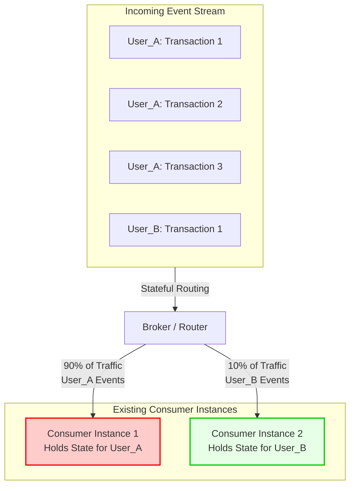
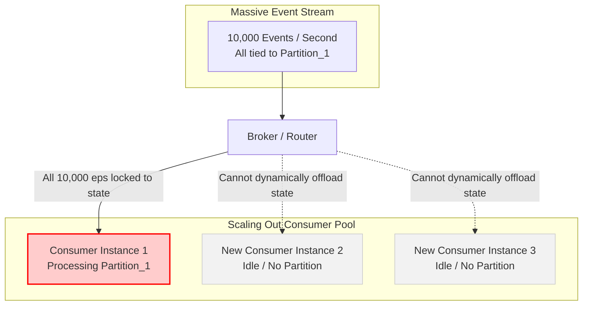

It is a very common point of confusion to view load balancing and horizontal scalability as the same concept, as both relate to handling traffic. However, they address two distinct operational dimensions:

* **Load Balancing** is about **distribution efficiency**: How evenly can we spread the current workload among our *existing* resources? (Avoiding hot spots where one server is at 100% CPU while another sits idle at 0%).
* **Horizontal Scalability** is about **growth capacity**: Can we increase our total throughput limit by *adding new* resources to the pool?

Here is a detailed breakdown of how Stateful EDA breaks both concepts in different ways, illustrated with structural diagrams.

---

## 1. The Load Balancing Problem: Uneven Distribution (Hot Spots)

Even if you have plenty of servers, a stateful architecture can cause one server to choke under heavy load while others sit completely idle. This is a routing and distribution failure.

### Why this is a Load Balancing Failure:
* **The Scenario:** You have two active servers (Instance 1 and Instance 2). 
* **The Problem:** `User_A` is highly active (e.g., a high-frequency trading account), while `User_B` is barely active. Because the system is stateful, **all** of `User_A`'s events must go to Instance 1.
* **The Result:** Instance 1 crashes due to CPU exhaustion (100% load), while Instance 2 is completely wasted (5% load). The system fails to balance the load across its *existing* capacity because of state affinity.

---

## 2. The Horizontal Scalability Problem: The Ceiling Limit

Even if your load is perfectly balanced among your current servers, you will eventually hit a performance ceiling. In a stateful system, adding more servers does not help you scale past this ceiling because the state cannot be easily split or moved.

### Why this is a Horizontal Scalability Failure:
* **The Scenario:** Your single consumer (Instance 1) is processing 10,000 events/sec for a specific stateful partition and has reached its physical hardware limit. You decide to "scale out" by spinning up Instance 2 and Instance 3.
* **The Problem:** Because the state is monolithic and bound to Instance 1's memory, the incoming stream cannot be split. 
* **The Result:** The new instances (2 and 3) sit completely idle. They cannot help process the 10,000 events/sec because they do not have access to the active state. The system has hit a **scalability ceiling**—adding more hardware does not increase performance.

---

## Summary of the Difference

| **Concept** | **The Core Question** | **The Stateful Failure Mode** | **Visual Analogy** |
|---|---|---|---|
| **Load Balancing** | "How do we distribute our *current* work among our *current* workers?" | One worker is completely overwhelmed while three others sit doing nothing because the work is locked to specific people. | A single long queue at a bank where only Teller 1 is allowed to serve VIP clients, leaving Teller 2 and 3 waiting. |
| **Horizontal Scalability** | "Can we handle *more* total work tomorrow by hiring *more* workers?" | Hiring new workers doesn't help because the task cannot be split up; only one person can hold the notebook containing the history of the project. | Adding more chefs to a kitchen, but only one chef is allowed to touch the single pot of soup. The soup cannot cook any faster. |