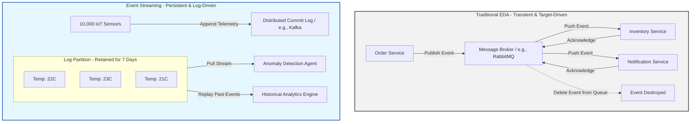
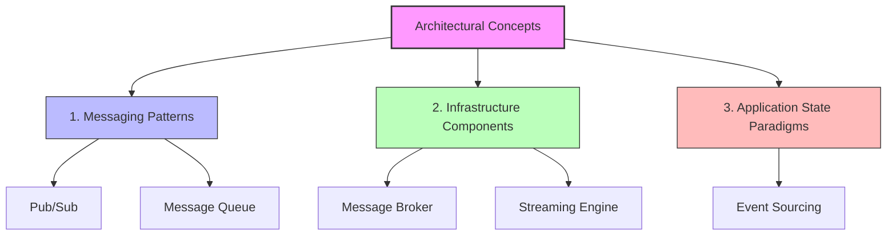

Here is a comprehensive, architect-level analysis of **Event Streaming vs. Event-Driven Architecture (EDA)**, followed by a rigorous classification of easily confused messaging terms and paradigms.

---

## 🧭 Context & Overview

In modern distributed systems, the terms "Event-Driven Architecture", "Event Streaming", "Pub/Sub", and "Event Sourcing" are frequently used interchangeably. This conceptual blurring leads to significant architectural mistakes—such as using a lightweight message queue to handle high-throughput telemetry, or using a massive streaming platform for simple point-to-point service triggers.

To build reliable, scalable architectures, we must draw clear boundaries between **architectural styles** (EDA vs. Event Streaming), **messaging patterns** (Pub/Sub vs. Queues), **infrastructure components** (Brokers), and **application state paradigms** (Event Sourcing).

Below is a structured guide to clarifying these concepts, complete with architectural diagrams and real-world scenarios.

---

## 🔍 Event-Driven Architecture (EDA) vs. Event Streaming

While both paradigms center around "events" (immutable facts representing something that happened), they serve fundamentally different purposes, handle different data lifecycles, and operate under distinct load profiles.

### 1. Traditional Event-Driven Architecture (EDA)
Traditional EDA is designed for **orchestrating business workflows inside a system**. It is command-and-control-oriented, where one internal service notifies other internal services about a state change.
* **Transient Nature (No Retention):** The message channel acts as a post office. Once an event (e.g., `OrderPlaced`) is delivered to and acknowledged by all registered consumers, it is **deleted** from the channel.
* **Targeted Interest:** The system only emits events that it knows consumers care about. Consequently, almost 100% of emitted events are processed.
* **Transaction/Workflow Oriented:** Used to decouple microservices (e.g., Order Service $\rightarrow$ Payment Service $\rightarrow$ Shipping Service).

### 2. Event Streaming
Event Streaming is designed for **continuous, high-throughput ingestion of real-time data streams**, typically originating from outside the core business logic.
* **Durable Retention (The Commit Log):** Events are appended to an immutable, disk-backed log and **retained** for a configurable period (e.g., 7 days, or indefinitely). Consumers do not delete events; they simply move their read pointer (offset) forward.
* **Replayability:** Because events are retained, a new consumer can be deployed today and "replay" the last 5 days of events to build its state.
* **High Ingestion Load:** Built to handle millions of events per second (e.g., clickstreams, financial market feeds, IoT sensor telemetry).
* **Consumer-Filtering:** The stream contains a raw torrent of data. Consumers pull the stream and decide which events to process, ignore, or aggregate.

---

## 🧩 Classification of Messaging Terms & Concepts

To avoid architectural confusion, we must classify these terms into their correct conceptual layers: **Patterns**, **Infrastructure**, and **Application Paradigms**.

### 1. Messaging Patterns (Logical Design)

#### Pub/Sub (Publish-Subscribe)
* **Concept:** A **one-to-many** distribution pattern. A producer publishes a message to a "Topic," and the messaging system automatically copies and delivers that message to all active subscribers.
* **Behavior:** Broadcast-oriented. If no consumers are subscribed when a message is published, the message is typically lost (unless durable subscriptions are configured).

#### Message Queue
* **Concept:** A **one-to-one** (or competing consumer) distribution pattern. A producer sends a message to a specific "Queue."
* **Behavior:** Point-to-point. Multiple consumers can listen to the same queue, but **only one consumer** will receive and process any given message. Once processed, the message is removed.

---

### 2. Infrastructure Components (Physical Implementations)

#### Message Broker (e.g., RabbitMQ, ActiveMQ)
* **Concept:** A smart middleware component that manages queues, routes messages based on complex rules (routing keys, headers), tracks individual message acknowledgments, and deletes messages immediately after delivery.
* **Best For:** Complex enterprise integration, transactional workflows, and routing.

#### Streaming Engine (e.g., Apache Kafka, AWS Kinesis)
* **Concept:** A dumb broker with a smart client. It is a highly optimized, distributed append-only log. The engine does not track which consumer has read which message; instead, the consumers themselves maintain their position (offset) in the log.
* **Best For:** High-throughput telemetry, log aggregation, real-time stream processing, and event replayability.

---

### 3. Is "Event Sourcing" a Paradigm like "Pub/Sub"?

**No, they belong to completely different layers of software architecture.**

* **Pub/Sub** is a **communication pattern** between different services over a network.
* **Event Sourcing** is an **application state paradigm** used *inside* a single microservice boundary to define how data is stored.

#### Event Sourcing Explained:
Instead of storing the *current state* of an entity in a relational database table (e.g., storing `Balance = $150` in a `Users` table), Event Sourcing stores the **entire history of changes** as an immutable sequence of events (e.g., `Deposited $100`, `Deposited $100`, `Withdrew $50`). The current state is reconstructed by replaying these events from the beginning of time.

---

## 💡 Real-World Scenario: A Modern Digital Banking Application

To see how all of these concepts coexist without conflict, let's look at a digital banking platform:

| **Business Feature** | **Technical Requirement** | **Architectural Concept Used** | **Technology Choice** | **Why?** |
|---|---|---|---|---|
| **Core Account Ledger** | Must have a 100% auditable trail of every transaction to prevent fraud and reconstruct balances. | **Event Sourcing** (Application Paradigm) | EventStoreDB / PostgreSQL Event Log | The absolute source of truth is the sequence of financial transactions, not just the final balance. |
| **New Transaction Alert** | When a transaction occurs, notify both the Fraud Detection Service and the Push Notification Service. | **Pub/Sub via Message Broker** (Messaging Pattern / Infra) | RabbitMQ / AWS SQS | One-to-many routing. The event is transient; once the push notification is sent and fraud is checked, the broker deletes the message. |
| **ATM Debit Card Processing** | Ensure that debit card transactions are processed strictly one-at-a-time per user to prevent double-spending. | **Message Queue** (Messaging Pattern) | RabbitMQ Queue | One-to-one processing. We need competing consumers for scale, but strict FIFO (First-In, First-Out) queueing per user account. |
| **Real-Time Fraud Analytics** | Analyze millions of card swipes, login attempts, and location pings per second across the globe to detect anomalies. | **Event Streaming** (Architectural Style) | Apache Kafka / Apache Flink | High-throughput ingestion of external telemetry. Events are retained so analytics models can look back at a 24-hour sliding window of user behavior. |