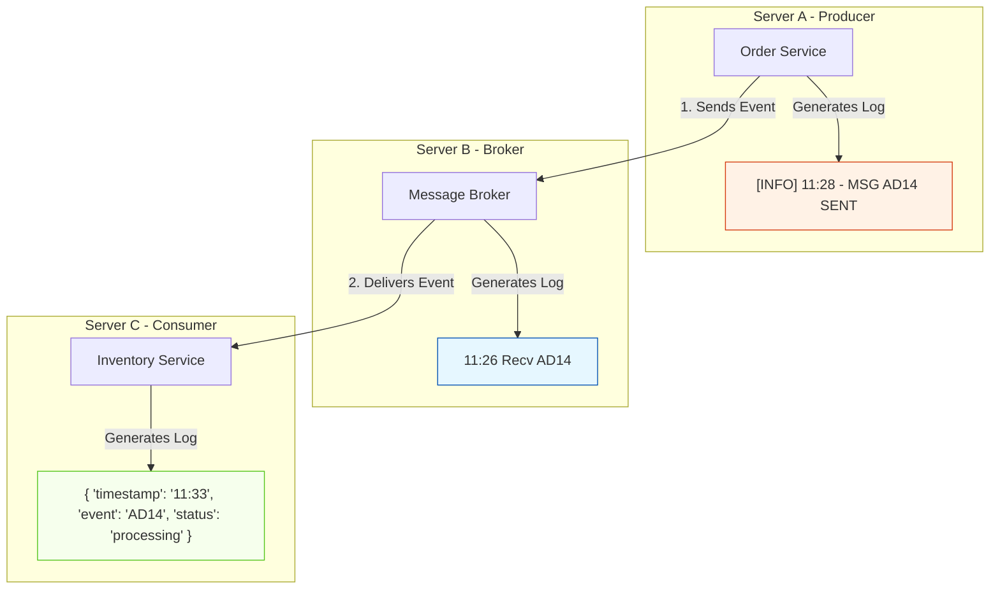

Technical analysis of the critical challenges of logging and monitoring in Event-Driven Architecture.

---

## The Observability Dilemma in EDA

Decoupling is the greatest strength of an Event-Driven Architecture (EDA), but it is also its greatest challenge when it comes to understanding system behavior. In a traditional monolithic or synchronous architecture, tracing a transaction is relatively straightforward because it occurs within the same execution thread or through direct, sequential call chains. 

In EDA, a single business event can trigger a chain reaction across multiple independent, asynchronous, and physically distributed services. Without a unified logging strategy, diagnosing a failure becomes an incredibly difficult troubleshooting task.

---

## The Four Critical Logging Challenges in EDA

When components operate without direct knowledge of one another, reconstructing the lifecycle of an event runs into four major operational barriers:

### 1. Clock Drift (Desynchronization)
It is physically impossible to guarantee that all servers in a network have the exact same time down to the millisecond. This slight temporal variation, known as clock drift, causes chronological paradoxes in logs. A message broker might register that it received an event at `11:26`, while the producer records sending it at `11:28`. Chronologically, it appears as though the event was processed before it was even created.

### 2. Scattered Destinations
Each microservice and infrastructure component (such as the message broker) writes logs to its own local environment, container, or physical file. To investigate a single failed purchase order, a developer must manually access and correlate log files across three or four different servers.

### 3. Inconsistent Formats
Because different teams often develop different components independently, services frequently use different log formats, such as plain text, structured JSON, or proprietary formats with varying metadata. This inconsistency prevents centralized monitoring tools from parsing and grouping information efficiently.

### 4. Loss of Causality (Tracing)
Because processing is asynchronous and highly concurrent, a consumer's logs will show a chaotic mix of hundreds of events being processed in parallel. Without a unifying thread, it is nearly impossible to determine which specific producer event triggered a corresponding consumer action.

---

## Logging Chaos in Action

The diagram below illustrates how a single event (`AD14`) generates fragmented, inconsistent, and chronologically contradictory logs across different physical servers due to a lack of synchronization and standards:

---

## Operational Impact Matrix

| Problem Symptom | Technical Cause | Business and Support Impact |
|---|---|---|
| **Chronological Paradox** | Clock drift between physical or cloud servers. | High difficulty in determining the root cause of a failure (which event occurred first). |
| **Incompatible Logs** | Lack of a standardized log serialization format (JSON vs. Plain Text). | Centralized monitoring tools (such as Elasticsearch or Splunk) cannot index and query the data correctly. |
| **Data Silos** | Localized log storage in individual containers or virtual machines. | Support teams spend hours collecting logs from multiple services to resolve a single customer issue. |
| **Loss of Context** | Lack of a shared identifier between the sent and received message. | Impossibility of reconstructing the end-to-end journey of a transaction. |

---

## The Path Forward: Correlation IDs

To resolve this chaos without breaking the valuable decoupling of our architecture, we cannot rely on perfectly synchronizing the clocks of every server in the network. Instead, we must introduce a mechanism that travels alongside the event throughout its entire lifecycle.

This concept is known as a **Correlation ID**: a globally unique identifier generated at the point of origin and propagated through every subsequent message, queue, and log. This allows centralized logging tools to instantly group all scattered telemetry associated with a single transaction.