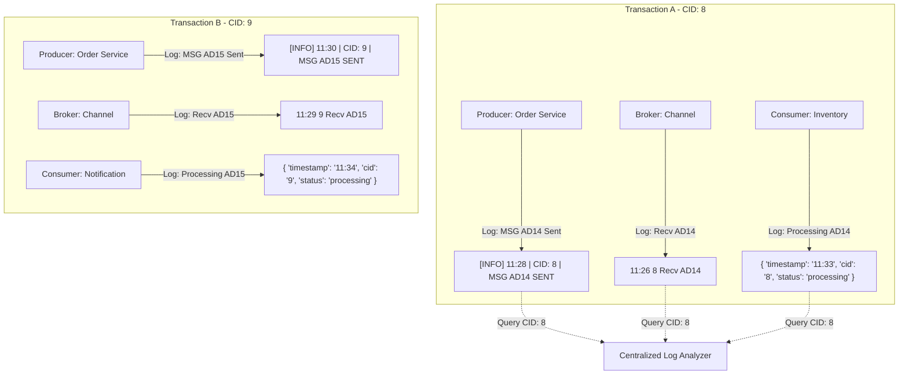

    Here is a structured overview of how Correlation IDs solve the distributed logging challenge, followed by a detailed breakdown of their mechanics and implementation.

---

## The Mechanics of Correlation IDs

A Correlation ID is a unique, pass-through identifier attached to the metadata of an event at its point of origin. As the event travels across various boundaries—from the producer, through the message broker, and into multiple downstream consumers—every component extracts this ID and includes it in its local log entries.

This simple mechanism shifts the paradigm of distributed debugging:
* **Decoupled Traceability:** Components do not need to know about each other's internal state or database structures. They only need to pass the Correlation ID along.
* **Chronological Independence:** Even if server clocks are desynchronized (clock drift), a centralized logging system can group all logs sharing the same Correlation ID and reconstruct the logical sequence of events.
* **Context Preservation:** It links asynchronous operations together, allowing developers to see the exact chain reaction triggered by a single user action.

---

## Visualizing Correlated Logs

The diagram below demonstrates how the introduction of a Correlation ID (represented as `CID`) groups fragmented and desynchronized logs into coherent, traceable transactions.

Despite the different log formats (JSON, XML, Plain Text) and the incorrect broker timestamp (`11:26` instead of after `11:28`), searching for `CID: 8` instantly isolates the entire lifecycle of Message 14.

---

## Implementation Best Practices

To successfully implement Correlation IDs in a production environment, architects should adhere to the following guidelines:

### Use Globally Unique Identifiers (UUIDs)
While using simple numbers like `8` or `9` is helpful for conceptual learning, production systems must use high-entropy identifiers to prevent collisions.
* **UUIDv4:** The industry standard, generating a 128-bit random number (e.g., `f81d4fae-7dec-11d0-a765-00a0c91e6bf6`).
* **ULID (Universally Unique Lexicographically Sortable Identifier):** An alternative that is lexicographically sortable, making it highly efficient for database indexing.

### Propagate via Message Headers
Never embed the Correlation ID inside the business payload of the event itself. Doing so pollutes the domain model with infrastructure concerns.
* **Metadata Envelope:** Pass the Correlation ID within the metadata or header section of the message protocol (e.g., HTTP Headers, Kafka Record Headers, or RabbitMQ Message Properties).
* **Automatic Extraction:** Configure middleware or interceptors at the entry and exit points of each service to automatically extract, store in thread-local storage (or async context), and inject the ID into outgoing messages.

### Centralize the Logs
A Correlation ID is only as good as your ability to search for it.
* **Log Aggregators:** Ship logs from all distributed servers to a centralized log management platform (such as Elasticsearch, Splunk, or Datadog).
* **Single Query Search:** These platforms index the Correlation ID field across all incoming formats, allowing developers to retrieve the entire distributed execution path with a single search query.

---

## Comparison: Uncorrelated vs. Correlated Logging

| Feature | Uncorrelated Logging | Correlated Logging |
|---|---|---|
| **Search Method** | Searching by approximate timestamp and server name. | Searching by a single unique ID (`CID`). |
| **Debugging Complexity** | High; requires manual correlation of multiple log files. | Low; the entire transaction path is retrieved instantly. |
| **Tolerance to Clock Drift** | Low; desynchronized clocks lead to false chronological ordering. | High; logical causality is preserved regardless of system time. |
| **Tooling Integration** | Difficult to automate tracing or APM visualization. | Enables automatic distributed tracing (e.g., OpenTelemetry, Jaeger). |