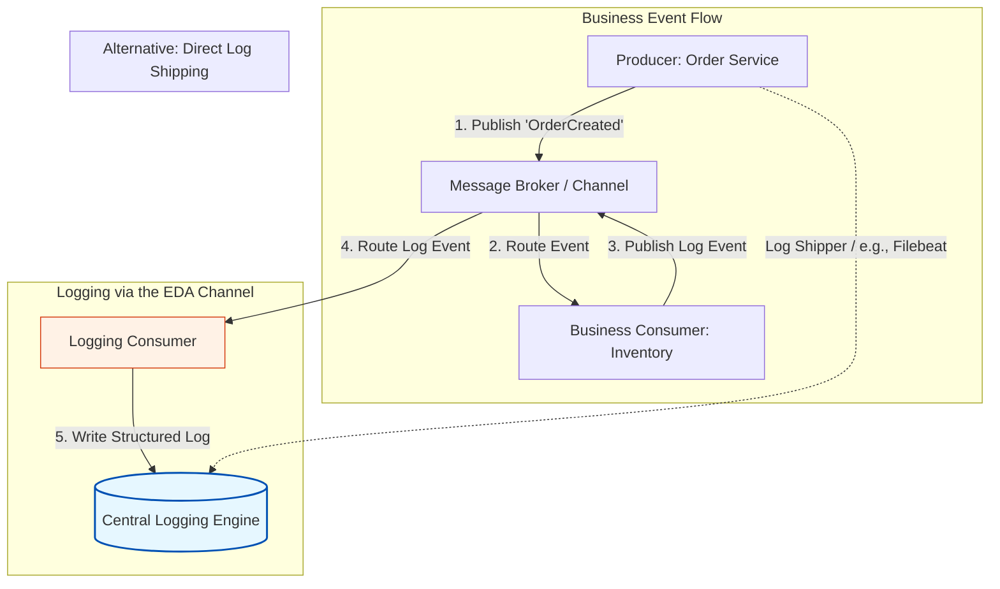

Here is a structured overview of the Centralized Logging Engine pattern and logging best practices in Event-Driven Architecture, followed by a detailed analysis of their implementation.

---

## The Centralized Logging Engine Pattern

A Centralized Logging Engine solves the operational nightmare of scattered log files and incompatible formats. Instead of forcing developers to log into individual servers or containers to view local text files, this pattern aggregates all log data into a single, highly indexable data store.

The engine performs three critical functions:
* **Aggregation:** It collects logs from every producer, consumer, and broker in the system, storing them in a central location.
* **Normalization:** It uses converters (or ingestion pipelines) to translate varying log formats (XML, plain text, custom formats) into a unified, structured format (typically JSON).
* **Visualization and Analytics:** It provides dashboards, query languages, and alerting mechanisms to monitor system health and trace transactions in real time.

---

## Visualizing Centralized Logging in EDA

There are two primary ways to transport logs to the central engine. A highly elegant approach in EDA is to **utilize the existing event channel** to transport log events, treating logging as just another asynchronous business concern.

### How the EDA-Based Log Transport Works:
1. The **Business Consumer** processes an event.
2. Instead of writing directly to a local file, it publishes a standardized `LogOccurred` event back to the **Message Broker**.
3. A dedicated **Logging Consumer** subscribes to these log events, processes them, and writes them directly into the **Central Logging Engine** (such as the Elastic Stack).
4. This keeps the business services completely decoupled from the logging database technology.

---

## What to Log: Reconstructing System Behavior

A critical mistake in distributed systems design is logging only when errors occur. While error tracking is vital, it only tells you *when* the system broke, not *how* it arrived at that broken state. 

To debug asynchronous race conditions and complex event chains, your logs must allow you to **replay the transaction** mentally.

### The Essential Event Logging Checklist

| **Log Category** | **What to Record** | **Why It Matters** |
|---|---|---|
| **Event Trigger** | The exact action that initiated the event (e.g., user click, file upload, cron timer). | Establishes the absolute origin of the transaction chain. |
| **Event Content** | The metadata, payload schema, and crucially, the **Correlation ID**. | Allows tracing the exact data payload as it mutates across services. |
| **Event Receipt** | The exact timestamp when a consumer pulled the event from the queue. | Helps identify queue bottlenecks and consumer processing delays. |
| **Event Completion** | The successful outcome of the consumer's processing logic. | Confirms that the event lifecycle completed successfully without silent failures. |
| **System Errors** | Stack traces, exception types, and the state of the system at the moment of failure. | Essential for debugging and triggering automated alerts. |

---

## Implementation Best Practices

### 1. Do Not Build Your Own Logging Engine
Developing a distributed, searchable, high-throughput database is highly complex. Utilize established, industry-standard tools:
* **The Elastic Stack (ELK):** Elasticsearch (storage/search), Logstash (conversion/ingestion), and Kibana (visualization).
* **OpenTelemetry:** A vendor-neutral standard for generating, emitting, and collecting telemetry data (logs, metrics, and traces).
* **Cloud-Native Solutions:** AWS CloudWatch, Datadog, or Grafana Loki.

### 2. Standardize on Structured Logging (JSON)
Force all services to output logs as structured JSON rather than raw text. 
* **Bad:** `[INFO] Order 123 processed successfully at 11:28`
* **Good:** `{"level": "INFO", "timestamp": "2026-07-19T11:28:00Z", "orderId": 123, "correlationId": "f81d4fae", "message": "Order processed successfully"}`
* **Benefit:** Centralized engines can index JSON keys automatically, making fields like `correlationId` or `orderId` instantly searchable.