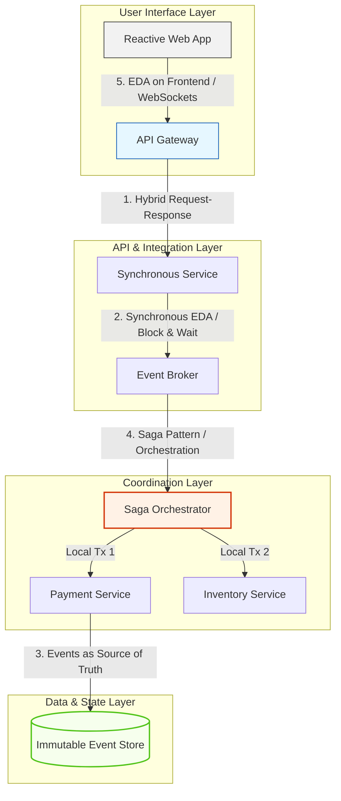

Here is a structured overview of the advanced paradigms in Event-Driven Architecture, followed by a detailed breakdown of the five advanced topics introduced in the lecture.

---

## The Transition to Advanced EDA: The 80/20 Rule

While standard asynchronous publish-subscribe patterns cover approximately 80% of typical integration scenarios, complex enterprise systems often demand patterns that push the boundaries of pure, decoupled event-driven design. 

As systems scale, architects encounter edge cases where pure asynchronous decoupling introduces unacceptable latency, transactional inconsistency, or frontend state desynchronization. Understanding these advanced patterns allows architects to selectively break or modify traditional EDA rules to solve complex, real-world business requirements.

---

## The Five Advanced EDA Paradigms Unpacked

The advanced landscape of EDA can be categorized into five distinct architectural patterns, each addressing a specific limitation of standard event-driven implementations:

### 1. Hybrid Request-Response and EDA
* **The Concept:** Combining synchronous HTTP/gRPC APIs with asynchronous event channels.
* **The Use Case:** A client requires an immediate confirmation (synchronous) that their request was received, but the actual processing of that request (such as generating a PDF report or processing a payment) occurs asynchronously in the background.

### 2. Synchronous EDA
* **The Concept:** Forcing an event-driven flow to block and wait for a response, effectively turning an asynchronous channel into a synchronous request-reply loop.
* **The Use Case:** Systems that require the decoupling benefits of an event broker but still need immediate, sequential validation from downstream consumers before proceeding.

### 3. Events as a Source of Truth
* **The Concept:** Moving away from traditional relational databases as the system of record and instead treating the immutable log of events as the absolute source of truth (closely tied to Event Sourcing).
* **The Use Case:** High-audit environments, such as ledger systems, where the history of how a state was reached is just as valuable as the current state itself.

### 4. The Saga Pattern
* **The Concept:** Managing distributed transactions across multiple microservices without relying on blocking two-phase commits (2PC). It coordinates a series of local transactions, triggering compensating events if a step fails.
* **The Use Case:** Multi-step business workflows, such as booking a trip (Flight $\rightarrow$ Hotel $\rightarrow$ Car Rental), where a failure in the final step must roll back the previous successful steps.

### 5. EDA on the Frontend
* **The Concept:** Extending the event-driven paradigm all the way to the user interface using technologies like WebSockets or Server-Sent Events (SSE).
* **The Use Case:** Real-time dashboards, collaborative tools, or live feed updates where the user interface reacts instantly to backend event emissions.

---

## Mapping Advanced EDA Concepts to System Layers

The diagram below illustrates how these five advanced concepts are distributed across different layers of a modern enterprise application, from the user interface down to the storage engine.

---

## Structural Comparison of Advanced Patterns

| **Advanced Pattern** | **Primary Objective** | **Typical Technology Stack** | **Primary Architectural Trade-off** |
|---|---|---|---|
| **Hybrid Request-Response** | Bridge user-facing synchronous actions with background async processing. | REST/gRPC + RabbitMQ/Kafka | Increases API Gateway complexity to manage async handoffs. |
| **Synchronous EDA** | Achieve decoupling while maintaining strict execution order. | Temporary reply-to queues, Correlation IDs | Reintroduces temporal coupling and increases processing latency. |
| **Events as Source of Truth** | Ensure absolute auditability and state reconstruction. | EventStoreDB, Kafka, PostgreSQL | High learning curve; requires CQRS to query current state efficiently. |
| **Saga Pattern** | Maintain eventual consistency across distributed databases. | Temporal, Camunda, Custom Event Handlers | High design complexity; requires writing complex rollback (compensating) logic. |
| **EDA on the Frontend** | Deliver real-time, reactive user experiences. | WebSockets, Server-Sent Events (SSE) | Heavy connection management overhead on the gateway servers. |