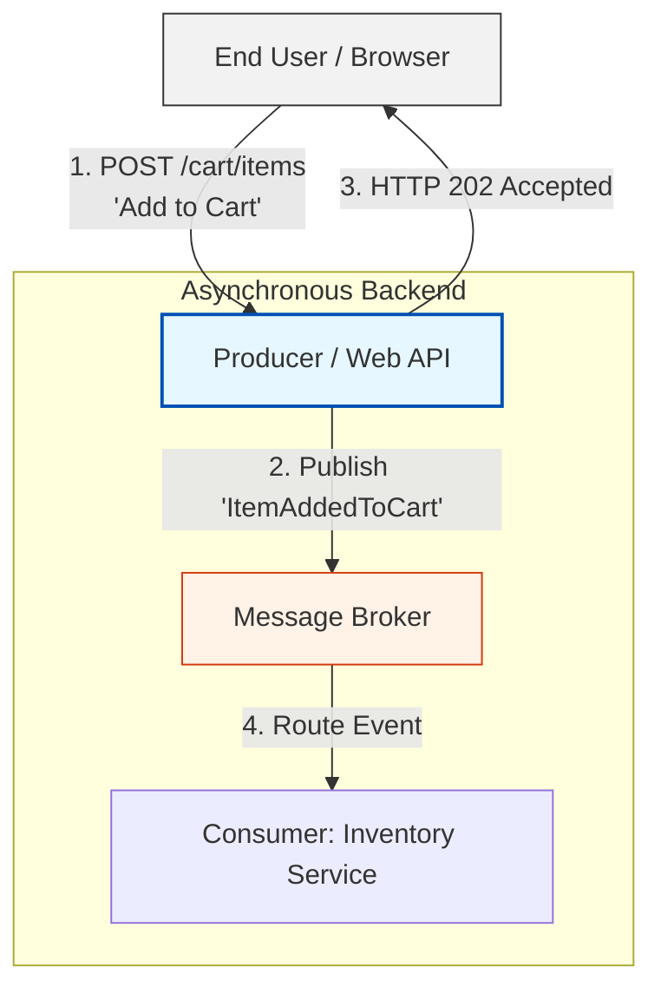

Here is a structured overview of how to mix Event-Driven Architecture with synchronous Request-Response patterns, followed by a detailed technical breakdown of this hybrid approach.

---

## The Necessity of Hybrid Architectures

In the real world, pure Event-Driven Architecture (EDA) is rarely implemented in isolation. The primary driver for this is the end user. User Interfaces (UIs)—whether web browsers, mobile apps, or desktop clients—require immediate feedback and high responsiveness. 

Because pure EDA is asynchronous and unidirectional (where a producer fires an event and does not wait for a reply), it is poorly suited for direct client-to-server interactions. To bridge this gap, modern systems implement a hybrid approach: they use synchronous **Request-Response** protocols (like REST or gRPC) at the user-facing edge, and transition to asynchronous **EDA** for background processing.

---

## Visualizing the Hybrid Request-Response & EDA Flow

The diagram below illustrates how a producer acts as a bridge, accepting a synchronous command from a user interface and translating it into an asynchronous event for the rest of the system.

### Step-by-Step Execution:
1. **The Request:** The user initiates an action (e.g., clicking "Add to Cart"). The browser sends a synchronous HTTP POST request to the Web API.
2. **The Event Generation:** The Producer (acting as the Web API) receives the request, validates it, and immediately publishes an asynchronous event (e.g., `ItemAddedToCart`) to the message broker.
3. **The Immediate Response:** Instead of waiting for the downstream inventory or payment services to finish processing, the Producer immediately returns an **HTTP 202 Accepted** status code to the client. This tells the UI: *"We received your request and are processing it in the background."*
4. **Asynchronous Processing:** The message broker routes the event to the appropriate consumers to complete the business logic out-of-band.

---

## The Role of HTTP Status Codes in Hybrid Systems

When mixing synchronous APIs with asynchronous backends, using the correct HTTP status codes is vital for setting client expectations.

| **HTTP Status Code** | **Semantic Meaning** | **When to Use in Hybrid EDA** |
|---|---|---|
| **200 OK** | The request has succeeded and the action is fully completed. | Use when the API only queries data (reads) that is already available, requiring no background event processing. |
| **201 Created** | The request has been fulfilled and has resulted in one or more new resources being created. | Use when the API immediately creates a resource shell or tracking ID before kicking off background processing. |
| **202 Accepted** | The request has been accepted for processing, but the processing has not been completed. | **The standard for Hybrid EDA.** Use when a command is validated and sent to the event broker, but downstream processing is still pending. |

---

## Architectural Best Practices

### 1. The Dual Role of the Producer
In this hybrid model, the Producer service must be designed to handle two distinct responsibilities:
* **API Gateway / Controller Role:** It must expose standard HTTP/REST endpoints, handle user authentication, validate incoming payloads, and manage client connections.
* **Event Publisher Role:** It must safely write validated events to the message broker. 

### 2. Guarding Against Broker Failures
Because the Web API must respond to the client immediately, any failure when writing to the message broker must be handled gracefully. If the broker is down, the Producer should not return a success code to the user. Implement patterns like the **Transactional Outbox Pattern** to ensure that database writes and event publishing succeed or fail together.

### 3. Managing Client Expectations (UI/UX)
Since the backend processes the event asynchronously, the UI must be designed to handle eventual consistency. 
* **Optimistic UI Updates:** The UI can immediately show the item in the cart, assuming the background operation will succeed.
* **Polling or WebSockets:** If the UI needs to know the exact moment the background processing completes, it can poll a status endpoint or listen to a WebSocket connection.