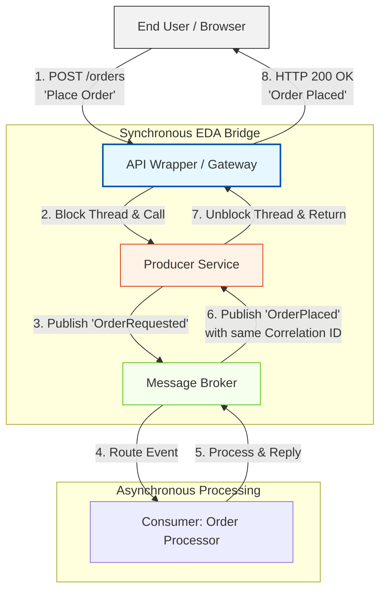

Here is a structured overview of Synchronous Event-Driven Architecture, followed by a detailed technical breakdown of how to implement this pattern and manage its inherent complexities.

---

## The Paradox of Synchronous EDA

By definition, Event-Driven Architecture (EDA) is asynchronous. The producer publishes an event to a channel and immediately continues its execution, completely decoupled from when or how downstream consumers process that message. 

However, business requirements occasionally demand a response to an event before the producer can proceed. When this occurs, we must implement **Synchronous EDA** (often referred to as the Request-Reply Pattern over Message Brokers). This pattern forces an asynchronous messaging channel to behave synchronously, blocking the calling thread until a corresponding "feedback event" is returned.

---

## Visualizing the Synchronous EDA Pattern

Implementing synchronous behavior over asynchronous channels requires managing state, threads, and correlation. To simplify this for client applications, architects often introduce a **Wrapper** or API Gateway layer that manages the blocking request thread while communicating asynchronously with the event broker.

### Step-by-Step Execution:
1. **The Request:** The client sends a synchronous HTTP request to the **Wrapper**.
2. **The Blocking Call:** The Wrapper invokes the **Producer** and holds the client's HTTP connection open (blocking the thread).
3. **The Event Dispatch:** The Producer publishes the event to the **Channel** and registers a temporary listener or callback queue, using a **Correlation ID** to map the future response.
4. **Downstream Processing:** The **Consumer** processes the event asynchronously.
5. **The Reply:** Once finished, the Consumer publishes a reply event back to the broker.
6. **The Correlation Handshake:** The Producer receives the reply event, matches the Correlation ID, and unblocks the waiting Wrapper thread.
7. **The Response:** The Wrapper returns the final status code and payload back to the end user.

---

## Implementation Strategies: Custom vs. Native

Achieving this "illusion of synchronicity" can be accomplished through custom application logic or by leveraging built-in broker capabilities.

### 1. Custom Implementation (The Dual-Thread Model)
If your broker does not natively support request-reply, the Producer must manage two separate contexts:
* **Thread A (Publisher):** Accepts the incoming request, generates a unique Correlation ID, publishes the event, and enters a blocked/waiting state (e.g., using a `Future` or `Promise` in code).
* **Thread B (Listener):** Listens to a dedicated reply-to queue. When a message arrives, it extracts the Correlation ID, finds the matching blocked thread, delivers the payload, and signals it to wake up.

### 2. Native Broker Support (Direct RPC)
Modern message brokers recognize this common requirement and provide built-in abstractions to handle the complexity:
* **RabbitMQ RPC:** RabbitMQ features native support for Direct reply-to. When publishing a message, the producer sets the `reply_to` header to a temporary, auto-deleted queue and includes a `correlation_id`. The consumer reads this header and automatically sends the response back to that specific queue, which the RabbitMQ client library manages seamlessly behind the scenes.
* **Spring Cloud Stream / JMS:** Many enterprise frameworks provide `RabbitTemplate.sendAndReceive()` or `JmsTemplate.sendAndReceive()` methods that abstract the entire blocking, listening, and correlation process into a single synchronous function call.

---

## Architectural Trade-offs of Synchronous EDA

While Synchronous EDA provides a clean way to bridge synchronous business requirements with event-driven backends, it introduces significant architectural trade-offs.

| **Architectural Attribute** | **Standard (Asynchronous) EDA** | **Synchronous EDA** |
|---|---|---|
| **Temporal Coupling** | **Low:** Services do not need to be online at the same time; messages buffer in queues. | **High:** The producer, broker, and consumer must all be online and responsive to complete the transaction. |
| **Resource Utilization** | **High:** Non-blocking I/O allows services to handle massive throughput without holding threads open. | **Low:** Server threads are held open (blocked) waiting for responses, consuming memory and CPU. |
| **Error Handling** | **Deferred:** Failed messages go to Dead Letter Queues (DLQ) for later retries without impacting the user. | **Immediate:** The system must handle timeouts, network drops, and consumer failures in real time. |
| **Complexity** | **Medium:** Requires managing eventual consistency. | **High:** Requires managing blocking threads, reply-to queues, timeouts, and correlation IDs. |