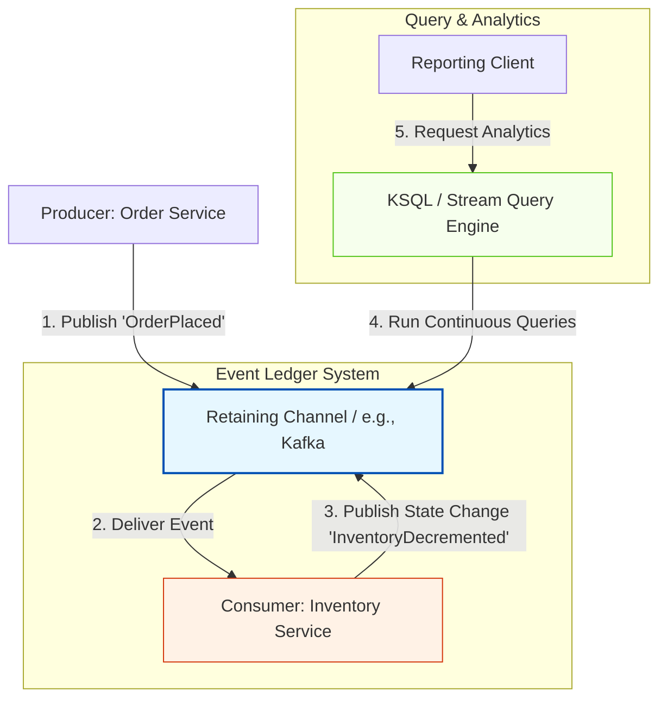

Here is a structured overview of the Events as a Source of Truth pattern, followed by a detailed technical analysis of how this paradigm shifts data ownership from traditional databases to event streams.

---

## Shifting the Source of Truth

In traditional software architectures, the database is the absolute system of record (the "Source of Truth"). In those systems, events are transient; they are used merely to trigger actions across services, while the actual operational state is immediately committed to a relational or non-relational database. 

However, in advanced event-driven systems, the event channel itself can be elevated to serve as the system of record. Instead of storing the current static state of an object, the system stores the entire history of immutable events that led to that state. If a consumer needs to record a change, it does not update a database row; instead, it publishes a new state-change event back to a retaining message channel.

---

## Visualizing Events as the Source of Truth

When events act as the source of truth, the traditional central database is bypassed for state storage. The retaining channel acts as an append-only ledger, and consumers query this ledger directly to reconstruct state.

### Step-by-Step Execution:
1. **The Initial Event:** The Producer publishes an event (e.g., `OrderPlaced`) to the retaining channel.
2. **Asynchronous Consumption:** The Consumer reads the event from the channel.
3. **State Mutation via Events:** Instead of updating an external SQL database, the Consumer calculates the new inventory level and publishes an `InventoryDecremented` event back to the same retaining channel.
4. **Querying State:** A stream query engine (like KSQL) continuously processes the event stream to answer queries about the current state of the system.

---

## Critical Prerequisites for Event-Centric Storage

Using an event channel as your primary data store is highly specialized and requires infrastructure that meets three strict technical criteria:

### 1. Durable Event Retention
Traditional message brokers (like RabbitMQ) delete messages as soon as a consumer acknowledges them. To use events as a source of truth, the channel must support long-term, durable storage (event retention). The broker must act as an append-only log where events are preserved indefinitely or for a long, configurable retention window.

### 2. Stream Query Capabilities
A simple queue only allows you to pull the next message in line. An event-centric source of truth requires a query engine that can inspect the entire historical log. For example, Apache Kafka supports **KSQL** (Kafka Query Language), which allows developers to write SQL-like queries directly against real-time event streams (e.g., aggregating all transaction events over the last 24 hours).

### 3. Stream-Centric Domain Design
This pattern is best suited for systems where the primary business value is derived from event streaming, telemetry, or audit trails, and where relational data modeling is highly simplified. If your application requires complex table joins, deep relational integrity, or heavy transactional locking, a traditional database remains the superior choice.

---

## Traditional Database vs. Event Store as Source of Truth

| **Architectural Attribute** | **Traditional Database** | **Event Store (e.g., Kafka)** |
|---|---|---|
| **Data Representation** | Stores the **current state** of the entity (e.g., `Status = "Shipped"`). | Stores the **sequence of mutations** (e.g., `Created` $\rightarrow$ `Paid` $\rightarrow$ `Shipped`). |
| **Data Mutability** | Mutable; data is overwritten using `UPDATE` and `DELETE` operations. | Immutable; events are append-only and can never be modified or deleted. |
| **Auditability** | Low; requires custom triggers or audit tables to track historical changes. | High; the historical log is built-in and serves as the audit trail by default. |
| **Query Flexibility** | High; supports complex relational SQL queries, joins, and indexing. | Moderate; optimized for stream processing and sequential queries (using tools like KSQL). |
| **State Reconstruction** | Instant; the database always holds the pre-calculated current state. | Event-driven; requires replaying historical events to rebuild the current state (Event Sourcing). |