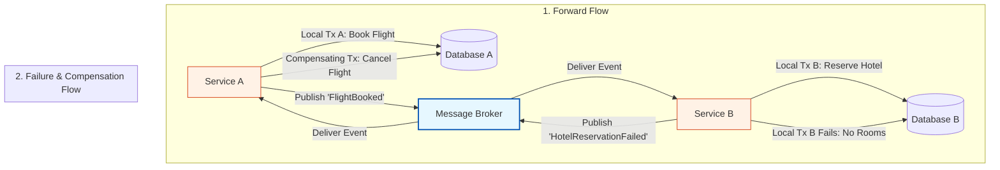

Structured overview of the Saga Pattern in Event-Driven Architecture, followed by a detailed technical breakdown of how it manages distributed transactions and eventual consistency.

---

## The Distributed Transaction Dilemma

In a microservices architecture, each service owns its own private database. This "Database-per-Service" pattern ensures loose coupling and independent scalability, but it breaks traditional ACID transactions. If a business workflow spans multiple services, you can no longer use a simple database `COMMIT` or `ROLLBACK` to ensure data integrity.

Historically, systems used the **Two-Phase Commit (2PC)** protocol to coordinate distributed transactions. However, 2PC is highly blocking, introduces a single point of failure, and severely limits system scalability. The **Saga Pattern** solves this dilemma by replacing a single, global transaction with a sequence of local, service-scoped transactions coordinated via asynchronous events.

---

## Visualizing the Saga Pattern with Compensating Transactions

When a step in a distributed transaction fails, the Saga pattern does not perform a database-level rollback. Instead, it triggers **Compensating Transactions**—backward-moving actions that programmatically neutralize or undo the effects of the previously completed steps.

### Step-by-Step Execution:
1. **Service A** executes its local transaction (e.g., booking a flight) and commits it to **Database A**.
2. **Service A** publishes a success event (`FlightBooked`) to the message broker.
3. **Service B** consumes the event and attempts its local transaction (e.g., reserving a hotel room) in **Database B**.
4. **The Failure:** The hotel reservation fails (e.g., no rooms available). **Service B** rolls back its own local transaction.
5. **The Failure Event:** **Service B** publishes a failure event (`HotelReservationFailed`) back to the broker.
6. **The Compensation:** **Service A** consumes the failure event and runs a compensating transaction (e.g., canceling the flight booking) in **Database A** to restore the system to a consistent state.

---

## Critical Trade-offs and Limitations

While the Saga pattern is the industry-standard approach for distributed transactions, it is not a silver bullet and introduces distinct architectural challenges.

### 1. Eventual Consistency vs. Strong Consistency
Sagas do not provide strong consistency. During the execution of a Saga, the system is in an **eventually consistent** state. For a brief window, a flight might be booked while the hotel reservation is still pending. If your business domain strictly forbids temporary inconsistencies (e.g., certain high-security financial ledgers), the Saga pattern may not be suitable.

### 2. The Compensation Failure Risk
A major vulnerability of the Saga pattern is that **compensating transactions can also fail**. If Service A's compensating transaction (canceling the flight) fails due to a network timeout or database outage, the system remains in an inconsistent state. 
* **Mitigation:** Sagas must rely heavily on retry mechanisms, idempotent event handlers, and dead-letter queues (DLQs). If automated compensation fails repeatedly, the system must trigger alerts for manual operational intervention.

### 3. Debugging and Observability Overhead
Because Sagas rely on a chain of asynchronous events bouncing between multiple services, tracing the flow of a single transaction is highly complex. This makes the implementation of **Correlation IDs** and **Centralized Logging Engines** absolutely mandatory to reconstruct and debug failed Sagas.

---

## When to Use the Saga Pattern

| **Use the Saga Pattern When...** | **Avoid the Saga Pattern When...** |
|---|---|
| The business workflow can tolerate **eventual consistency** (e.g., e-commerce orders, travel bookings). | The system requires **strong consistency** and zero-tolerance for temporary data mismatches. |
| Clear, logical **compensating transactions** can be defined for every step (e.g., canceling a booking, refunding a payment). | Actions are physically or legally irreversible (e.g., sending an email, printing a physical label, executing a wire transfer). |
| The workflow is long-running and involves multiple independent microservices. | The transaction can be handled within a single microservice database boundary. |

## Clarifying the Confusion: ACID vs. SAGA

To understand the Saga pattern, we must first separate the concepts of **ACID** (a set of transactional guarantees) and **SAGA** (an architectural pattern). 

* **ACID** is a design standard for **local, single-database transactions**. It guarantees that a set of database operations are executed as a single, atomic unit: either everything succeeds, or everything is rolled back instantly.
* **SAGA** is an architectural pattern for **distributed systems**. It manages business transactions that span multiple microservices, each with its own independent database. Because you cannot run a single ACID transaction across physically separated databases without severe performance penalties, a Saga breaks the business process into a series of smaller, local ACID transactions coordinated by events.

---