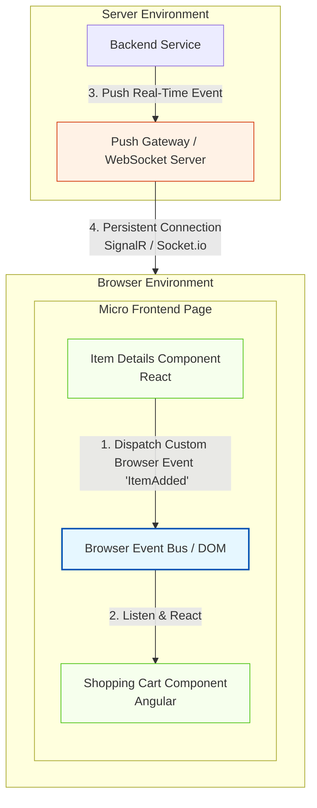

Here is a structured overview of Event-Driven Architecture (EDA) on the Frontend, followed by a detailed technical analysis of how event-driven principles are applied to client-side applications.

---

## Extending EDA to the Client Side

While Event-Driven Architecture is traditionally discussed as a backend pattern for decoupling microservices, its core principles—asynchronous communication, loose coupling, and reactive behavior—are highly valuable on the frontend. 

As modern user interfaces grow in complexity, treating the client side as a static, request-response environment is no longer sufficient. Extending EDA to the frontend allows architects to solve two major modern UI challenges: coordinating independent UI components within a single page, and pushing real-time data from the backend to the user without constant polling.

---

## The Two Pillars of Frontend EDA

Frontend EDA is primarily implemented through two distinct architectural patterns: **Micro Frontends** (internal client-side communication) and **Push Notifications** (server-to-client communication).

---

## Detailed Breakdown of Frontend EDA Patterns

### 1. Micro Frontends (De-coupled UI Components)
Just as microservices break a backend monolith into independent services, micro frontends break a frontend monolith into independent, self-contained UI components. 
* **The Challenge:** If Component A (e.g., an Item Details view) and Component B (e.g., a Shopping Cart header) are developed by different teams using different frameworks, they cannot easily share state or call each other's functions directly.
* **The EDA Solution:** The components communicate using native **Browser Events** (CustomEvents) or a lightweight client-side event bus. When a user clicks "Add to Cart" in the React-based Item Details component, it dispatches a custom DOM event. The Angular-based Shopping Cart component listens for this event on the global window object and updates its count accordingly.
* **Technology:** Native HTML5 Custom Elements, CustomEvent API, and window event listeners.

### 2. Push Notifications (Server-to-Client Streaming)
In standard web applications, the client must initiate all communication via HTTP requests. For real-time applications (like chat apps, live dashboards, or financial tickers), this requires inefficient polling.
* **The Challenge:** The server needs to immediately notify the client when a backend event occurs, without waiting for the client to ask for it.
* **The EDA Solution:** Establish a persistent, bi-directional communication channel between the client and the server. When a backend event occurs, the server pushes the event payload directly down to the active client connection.
* **Technology:** WebSockets, Server-Sent Events (SSE), and abstraction libraries like **SignalR**, **Socket.IO**, or **gRPC-Web**.

---

## Technology Comparison for Server-to-Client Push

When implementing real-time push notifications from the backend to the frontend, architects typically choose from the following industry-standard frameworks:

| **Framework / Library** | **Primary Transport Protocol** | **Key Strengths** | **Best Use Case** |
|---|---|---|---|
| **SignalR** | WebSockets (with fallback to Server-Sent Events or Long Polling) | Automatic protocol fallback, excellent integration with .NET ecosystems, built-in hubs for grouping connections. | Enterprise web applications, real-time dashboards, collaborative tools. |
| **Socket.IO** | WebSockets (with HTTP long-polling fallback) | Extremely popular in the Node.js ecosystem, robust reconnection handling, room-based broadcasting. | Real-time chat applications, multiplayer browser games. |
| **gRPC-Web** | HTTP/2 Streams | Strongly typed contracts (Protocol Buffers), high performance, low payload size. | High-throughput streaming, microservice-to-frontend communication in polyglot environments. |