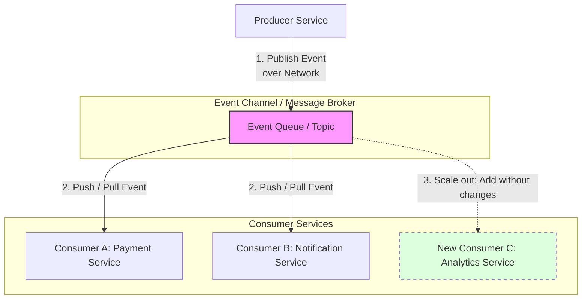

Technical analysis of the decision criteria, application scenarios, and architectural trade-offs when adopting an **Event-Driven Architecture (EDA)** 

---

## 1. When to Adopt an Event-Driven Architecture (EDA)

Event-Driven Architecture (EDA) is a software design paradigm where service communication is driven by the production, detection, and consumption of **events**. 

While EDA offers exceptional decoupling, its implementation introduces considerable operational complexity. Therefore, its adoption must be justified under three fundamental pillars:

### A. Need for Elastic and Independent Scalability
In EDA, scalability is a native feature due to the extreme decoupling between producers and consumers.
* **Fluctuating Load:** If the system experiences unpredictable traffic spikes (e.g., an e-commerce platform during Black Friday), consumers can be added or removed on demand without altering the producer or the communication channel.
* **Frictionless Growth:** New business capabilities can be integrated simply by connecting a new consumer to the existing event channel, without needing to modify or redeploy the services originating the data.

### B. Predominance of Asynchronous Interactions (Fire-and-Forget)
The success of EDA depends on business processes being able to execute in a non-blocking manner.
* **Background Processing:** Operations such as payment processing, sending confirmation emails, generating reports, or writing audit logs do not require the user to wait for an immediate response. The producer emits the event and continues its execution.
* **The Query Factor:** Data queries are inherently synchronous (the client needs the information immediately). The more synchronous queries your system requires between services, the less relevant EDA becomes.

### C. Highly Reliable Network Infrastructure
Since communication in EDA moves from in-memory process calls to the network (via message brokers like RabbitMQ, Kafka, or AWS EventBridge), the network becomes the circulatory system of the architecture.
* **Latency and Bandwidth:** A massive volume of events requires a fast, low-latency network to avoid delivery bottlenecks.
* **Network Resilience:** The infrastructure must support retry mechanisms, failure detection, and duplicate message handling without degrading overall system performance.

---

## 2. Communication Flow in EDA

The following `TD` (Top-Down) diagram illustrates how components interact within an event-driven architecture and how horizontal scalability is achieved by adding new consumers without altering the existing flow.

---

## 3. Decision Matrix: EDA vs. Traditional Synchronous Architecture

| **Evaluation Dimension** | **Synchronous Architecture (REST / gRPC)** | **Event-Driven Architecture (EDA)** |
|---|---|---|
| **Communication Model** | **Blocking (Synchronous):** The sender waits for the receiver's response before proceeding. | **Non-blocking (Asynchronous):** The sender publishes the event and moves on (*Fire-and-Forget*). |
| **Coupling Degree** | **High:** The sender must know the receiver's location (IP/DNS) and API contract. | **Low:** The sender only knows the event channel; it has no awareness of who (or how many) consume the message. |
| **Scalability** | Complex to scale under extreme load due to chaining synchronous calls. | **Excellent:** Consumers scale independently based on the queue load. |
| **Monitoring & Debugging** | Simple (linear and straightforward stack traces). | **Complex:** Requires distributed tracing tools (e.g., OpenTelemetry) and correlation IDs. |
| **Network Dependency** | Critical for immediate system availability. | Critical for latency and message delivery, but tolerates temporary consumer downtime. |

---

## 4. Summary of Advantages and Challenges (Pros & Cons)

### Advantages (Pros)
* **Absolute Decoupling:** Producer and consumer services evolve, deploy, and scale completely independently.
* **Improved Fault Tolerance:** If a consumer goes down, events safely accumulate in the channel (broker) and are processed once the service recovers, preventing data loss.
* **Business Flexibility:** Easily react to market changes or new technical requirements by adding new analytical or processing consumers without touching existing code.

### Challenges (Cons)
* **Complex Monitoring and Logging:** Tracking a business process across multiple asynchronous services requires advanced APM tools and distributed tracing.
* **Eventual Consistency:** Since traditional distributed transactions (2PC) are absent, the system must be designed to accept that data will take time to synchronize across all services.
* **Infrastructure Complexity:** Requires provisioning, configuring, tuning, and maintaining highly available and fault-tolerant message brokers.

---

## Architectural Synthesis

Event-Driven Architecture is not a silver bullet and should not be adopted simply as a technology trend. 

For classic information systems, internal administrative portals, or systems with predominantly synchronous workflows (where the user requires immediate hard-consistency confirmation), traditional architectures based on synchronous APIs (REST/gRPC) and relational databases remain the most efficient and cost-effective choice.

The design recommendation is to **reserve EDA for system boundaries** or specific subdomains where elastic scalability, asynchronous processing, and the decoupling of critical services (such as payment gateways or telemetry ingestion) fully justify the infrastructure investment and operational complexity.

